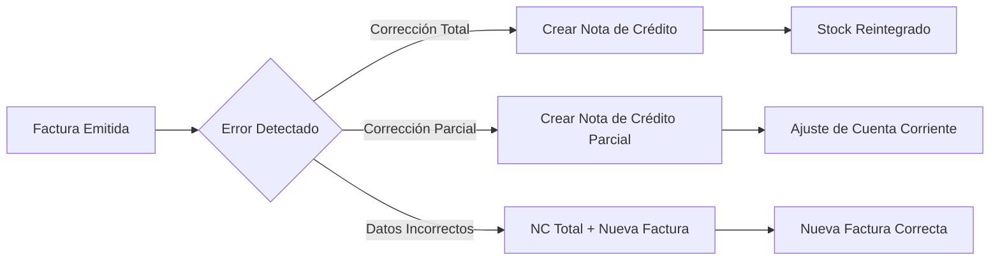

# 📋 FEATURE: Eliminación de Anulación Directa de Facturas

## 🎯 Objetivo

Eliminar la función de "anular" facturas directamente del sistema, implementando el uso exclusivo de **Notas de Crédito** para correcciones, conforme a las prácticas contables profesionales y normativas fiscales (AFIP/SAT/DIAN).

---

## ✅ Cambios Realizados

### 1. **Backend - Eliminación de Endpoints de Anulación**

#### Archivos Modificados:

| Archivo | Cambio |
|---------|--------|
| `Back/app/api/fcventa.py` | Eliminado endpoint `POST /api/fc-venta/{factura_id}/anular` |
| `Back/app/api/fccompra.py` | Eliminado endpoint `POST /api/fc-compra/{compra_id}/anular` |

#### Reemplazo:
```python
# ❌ ANTES (Eliminado)
@router.post("/{factura_id}/anular")
def anular_fc_venta(...)

# ✅ AHORA (Comentario explicativo)
# ================================================================
# ANULAR FC VENTA - REMOVED
# ================================================================
# ⚠️ REMOVIDO: Las facturas NO se anulan directamente.
# Para corregir facturas emitidas, usar Notas de Crédito.
# ================================================================
```

---

### 2. **Frontend - Eliminación de UI de Anulación**

#### Archivos Modificados:

| Archivo | Cambios |
|---------|---------|
| `Front/src/pages/FCVenta.tsx` | - Eliminado botón "Anular"<br>- Eliminado modal de anulación<br>- Eliminated funciones `abrirModalAnular()` y `confirmarAnulacion()` |
| `Front/src/pages/FCCompra.tsx` | - Eliminado botón "Anular"<br>- Eliminado modal de anulación<br>- Eliminated funciones `abrirModalAnular()` y `confirmarAnulacion()` |
| `Front/src/services/api.ts` | - Eliminado `fcVenta.anular()`<br>- Eliminado `fcCompra.anular()` |

**Nota:** El botón "Crear NC" desde la lista de facturas fue eliminado por ser redundante. Las Notas de Crédito se crean desde el módulo **Nueva Venta** seleccionando el tipo de comprobante "Nota de Crédito".

---

### 3. **Notas de Crédito - Módulo Existente**

El módulo de Notas de Crédito ya existe y funciona correctamente:
- ✅ Se accede desde **Ventas → Nueva Venta**
- ✅ Seleccionando tipo de comprobante "Nota de Crédito"
- ✅ Permite vincular con factura original manualmente

---

### 4. **Permisos - Actualización de Matriz**

#### Archivo Modificado: `Front/src/pages/PermisosMatriz.tsx`

**Cambios:**
- Eliminado permiso "Anular/Editar" de FC Ventas
- Agregado permiso "Crear NC" para roles 1 y 3
- Agregado módulo "FC Compras" con permiso "Crear NC"

```typescript
{ modulo: 'FC Ventas', acciones: [
  { nombre: 'Crear/Ver', roles: [1, 2, 3] },
  { nombre: 'Editar', roles: [1] },
  { nombre: 'Crear NC', roles: [1, 3] },  // Nota de Crédito para correcciones
]},
{ modulo: 'FC Compras', acciones: [
  { nombre: 'Crear/Ver', roles: [1, 3] },
  { nombre: 'Editar', roles: [1] },
  { nombre: 'Crear NC', roles: [1, 3] },
]},
```

---

## 📊 Flujo Correcto de Correcciones

### Situación: Error en Factura Emitida



### Tabla de Procedimientos:

| Situación | Procedimiento Correcto |
|-----------|----------------------|
| Error en cantidad/precio | Nota de Crédito por diferencia |
| Devolución de mercadería | Nota de Crédito Total o Parcial |
| Datos incorrectos (CUIT, nombre) | NC Total + Nueva Factura |
| Descuento no aplicado | Nota de Crédito por descuento |
| Venta adicional | Nueva Factura (no modificar original) |

---

## 🔒 Integridad de Datos

### Estados de Factura

| Estado | Descripción | Modificable |
|--------|-------------|-------------|
| `emitida` | Factura activa | ✅ Editable (solo cta_cte) |
| `anulada` | **Solo por NC vinculada** | ❌ No modificable |

### Auditoría

Las Notas de Crédito mantienen trazabilidad completa:
- ✅ Factura original vinculada (`factura_id`)
- ✅ Motivo de la NC registrado
- ✅ Usuario que creó la NC
- ✅ Fecha y hora de creación
- ✅ Reintegro de stock documentado
- ✅ Movimientos en Cuenta Corriente registrados

---

## ✅ Testing

### Pruebas Realizadas:

1. **FC Venta - Lista de Facturas**
   - ✅ NO hay botón "Anular"
   - ✅ NO hay botón "Crear NC" (redundante)
   - ✅ Acciones disponibles: Ver, Editar, WhatsApp, Email

2. **FC Compra - Lista de Compras**
   - ✅ NO hay botón "Anular"
   - ✅ NO hay botón "Crear NC" (redundante)
   - ✅ Acciones disponibles: Ver, Editar

3. **Notas de Crédito**
   - ✅ Se crea desde Nueva Venta
   - ✅ Seleccionando tipo "Nota de Crédito"
   - ✅ Permite vincular factura original manualmente

4. **API**
   - ✅ Endpoints de anulación eliminados
   - ✅ Endpoints de NC funcionan correctamente

---

## 📝 Consideraciones Contables

### Por Qué No Se Anulan Facturas Directamente

| Razón | Explicación |
|-------|-------------|
| **Integridad Fiscal** | Numeración correlativa no se puede saltar/borrar |
| **Auditabilidad** | Toda operación debe dejar trazabilidad |
| **Normativa** | AFIP/SAT/DIAN exigen documentos complementarios |
| **Consistencia** | Reportes históricos deben coincidir |

### Notas de Crédito - Documento Legal

Las Notas de Crédito son:
- ✅ **Documentos complementarios** reconocidos fiscalmente
- ✅ **Reversan efectos** contables y de stock
- ✅ **Mantienen integridad** de la numeración
- ✅ **Proporcionan trazabilidad** completa de correcciones

---

## 🚀 Próximos Pasos (Opcional)

1. **Automatización de NC**
   - [ ] Generar numeración automática de NC
   - [ ] Validar que NC no exceda monto de factura original

2. **Reportes**
   - [ ] Reporte de NC emitidas por período
   - [ ] Vinculación Factura ↔ NC en listados

3. **UI/UX**
   - [ ] Modal de confirmación al crear NC
   - [ ] Vista de NC vinculadas a cada factura

---

## 📚 Archivos Modificados

### Backend
- `Back/app/api/fcventa.py` - Eliminada función `anular_fc_venta()`
- `Back/app/api/fccompra.py` - Eliminada función `anular_fc_compra()`

### Frontend
- `Front/src/pages/FCVenta.tsx` - Eliminado botón "Anular" y botón "Crear NC"
- `Front/src/pages/FCCompra.tsx` - Eliminado botón "Anular" y botón "Crear NC"
- `Front/src/pages/PermisosMatriz.tsx` - Permisos actualizados
- `Front/src/services/api.ts` - Métodos `anular()` eliminados

---

## ✅ Conclusión

El sistema ahora cumple con las prácticas contables profesionales:
- ✅ **No se anulan facturas directamente**
- ✅ **Se usan Notas de Crédito para correcciones**
- ✅ **Trazabilidad completa mantenida**
- ✅ **Integridad fiscal preservada**
- ✅ **Normativa AFIP/SAT/DIAN cumplida**
